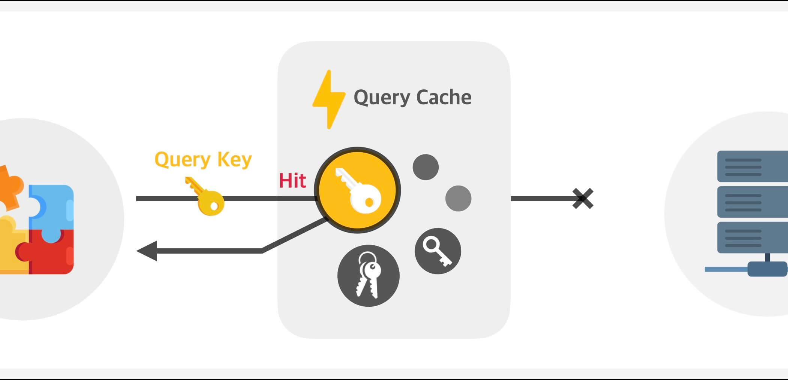
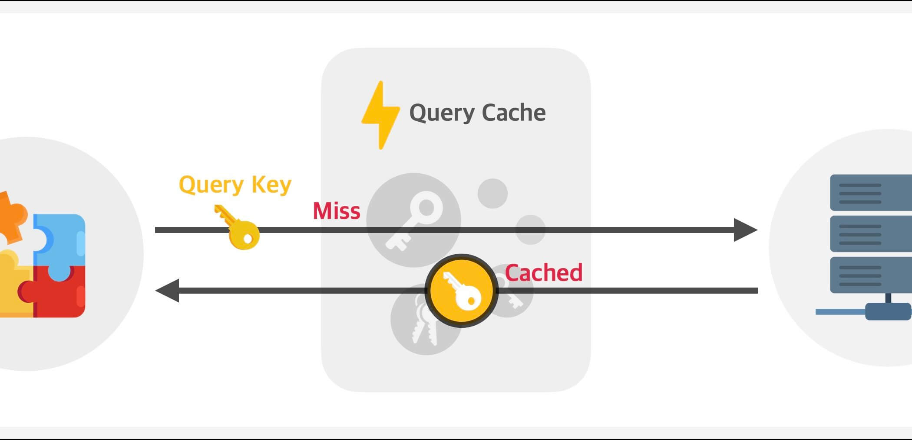

# Tanstack Query


## 개요

TanStack Query란 서버로부터 데이터를 받아오거나, 데이터 캐싱, 캐시 제어, 동기화, 업데이트 등 데이터를 쉽고 효율적으로 관리할 수 있는 라이브러리입니다.

기존의 이름은 React Query였으나, V4 부터 React 외에도 Vue, Solid, Svelte 등 더욱 다양한 프레임워크를 지원하게 되면서 이름이 변경되었습니다.

### TanStack Query의 대표적인 기능

- 데이터 가져오기 및 캐싱
- 동일 요청의 중복 제거
- 신선한 데이터 유지
- 무한 스크롤, 페이지네이션 등의 성능 최적화
- 네트워크 재연결 및 요청 실패 등의 자동 갱신화

## 데이터 캐싱

Tanstack Query는 데이터를 캐싱하여 데이터를 빠르게 가져올 수 있도록 도와줍니다.

데이터를 가져오기 위해서는 항상 쿼리 키(`queryKey`)를 전달해야 합니다.

이 쿼리 키는 캐시된 데이터와 비교해 새로운 데이터를 받아올지, 캐시된 데이터를 사용할지 결정하는 역할을 합니다.

```tsx
import { useQuery } from '@tanstack/react-query'

export default function TodoList() {
  const {
    data: todos, // 데이터의 이름을 todos 로 명명
  } = useQuery({
    queryKey: ['todos'], // 쿼리 키
    queryFn: async () => {
      const response = await fetch('https://api.example.com/todos')
      if (!response.ok) {
        throw new Error('Network response was not ok')
      }
      return response.json()
    },
  })
  return (
    <>
      <div>{todos}</div>
    <>
  )
}
```

다음 이미지는 쿼리 키와 일치하는 캐시된 데이터가 없을때, 있을때의 차이를 보여줍니다.





캐시가 없을 땐, 서버에서 데이터를 가져오면 그 데이터는 캐시화 되어 다음 요청부터는 캐시된 데이터로 사용됩니다.

캐시가 있을 땐, 서버에서 데이터를 가져오지 않고 캐시된 데이터를 사용합니다.

## 데이터의 신선도

```tsx
import { useQuery } from '@tanstack/react-query'

export default function TodoList() {
  const {
    data: todos, // 데이터의 이름을 todos 로 명명
    isStale, // 데이터가 신선한지 여부
  } = useQuery({
    queryKey: ['todos'], // 쿼리 키
    queryFn: async () => {
      const response = await fetch('https://api.example.com/todos')
      if (!response.ok) {
        throw new Error('Network response was not ok')
      }
      return response.json()
    },
    staleTime: 1000 * 60, // 1분 동안 데이터를 "신선"하다고 간주
    gcTime: 1000 * 60 * 5, // 5분 동안 캐시 유지
  })
  return (
    <>
      <div>{todos}</div>
      <div>데이터가 신선한가요? {isStale ? '아니요' : '예'}</div>
    <>
  )
}
```

## 알아두는 용어정리

<details>
<summary><strong>데이터 캐싱이란?</strong></summary>

데이터 캐싱은 자주 사용되는 데이터를 메모리나 저장소에 임시로 저장해두고 재사용하는 기술입니다.

#### 주요 목적

1. **성능 최적화**: 서버 요청 없이 저장된 데이터를 즉시 사용
2. **네트워크 부하 감소**: 중복 요청을 방지하여 서버 부하와 네트워크 트래픽 감소
3. **사용자 경험 향상**: 데이터를 더 빠르게 제공하여 앱의 응답성 개선

#### 실제 예시

- 게시글 목록을 한 번 불러온 후 캐싱하여, 다른 페이지 갔다가 돌아올 때 즉시 표시
- 사용자 프로필 정보를 캐싱하여 여러 컴포넌트에서 재사용
- API 응답 데이터를 캐싱하여 동일한 요청에 대해 서버 호출 최소화

#### 고려사항

- 캐시된 데이터의 유효 기간 (staleTime) 설정
- 캐시 데이터의 최신성 관리
- 메모리 사용량 관리 (캐시 크기 제한)

</details>

## 레퍼런스

[공식문서](https://tanstack.com/query/latest)

[참고 블로그](https://www.heropy.dev/p/HZaKIE)
